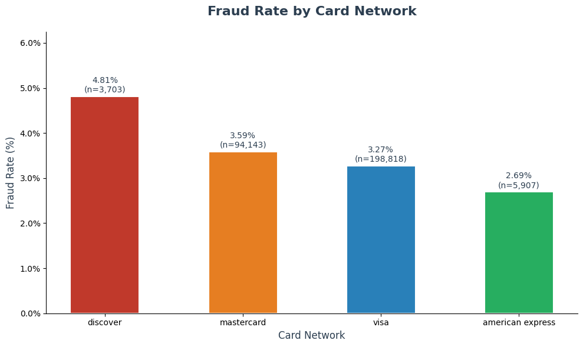

# A Machine Learning Approach to Scoring Online Transaction Risk

## Hook
As a bank fraud analyst, you are the line of defense against financial crime. Every day you sift through thousands of flagged transactions, while fraudsters continuously adapt their tactics to evade detection. Miss a fraudulent transaction and the bank absorbs the loss. Flag too many legitimate ones and you frustrate customers and erode trust. There has to be a smarter way to prioritize your workload.

## Problem Statement
Online transaction fraud has become one of the most pressing challenges facing  banking. Traditional rule-based fraud detection systems are increasingly inadequate in the face of sophisticated and evolving fraud tactics. These systems generate excessive false positives, flagging legitimate transactions as fraudulent, while missing new fraud patterns entirely. Bank fraud analysts are left reading through enormous volumes of flagged transactions with limited tools to prioritize their efforts, reducing efficiency and increasing the window of exposure to financial loss.

## Solution
This project develops a machine learning pipeline that scores online transactions by their probability of being fraudulent from analyzing payment behavioral features such as card type, billing address, transaction amount, and product category. The solution is built on the IEEE-CIS Fraud Detection dataset and implemented using Python, SQL, and DuckDB. A key challenge in fraud detection is class imbalance, where fraudulent transactions represent a small minority of all activity. It will be addressed using SMOTE, a method that generates synthetic fraud examples during training to ensure the model learns fraud patterns effectively rather than defaulting to predicting every transaction as legitimate. The core prediction engine uses ensemble learning to combine the outputs of multiple models and produce a more robust probability score than any single model could achieve alone. Model performance is further optimized through Bayesian optimization, an hyperparameter tuning strategy that efficiently searches for the best model configuration by learning from tuning iterations. This pipeline learns complex patterns from hundreds of thousands of historical transactions and assigns each new transaction a continuous risk score, allowing bank fraud analysts to rank and prioritize flagged transactions by likelihood of fraud and focus their attention where it matters most.

## Chart

